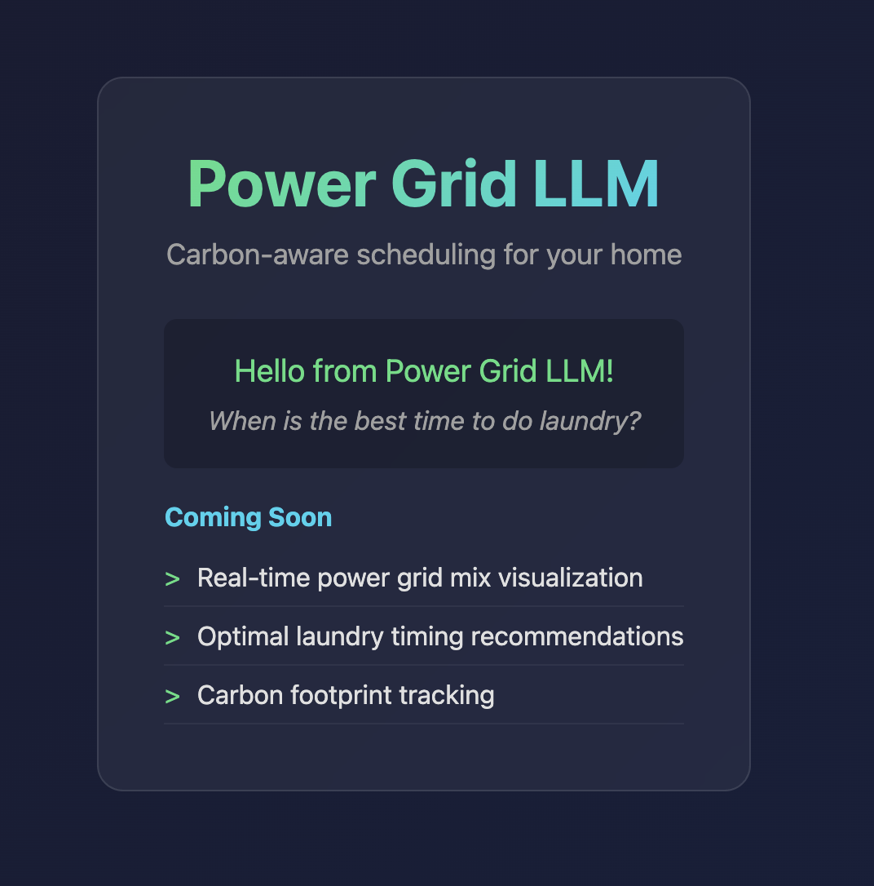
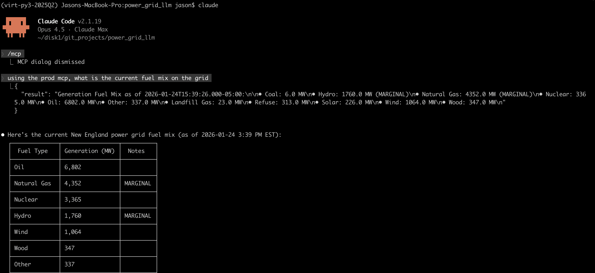
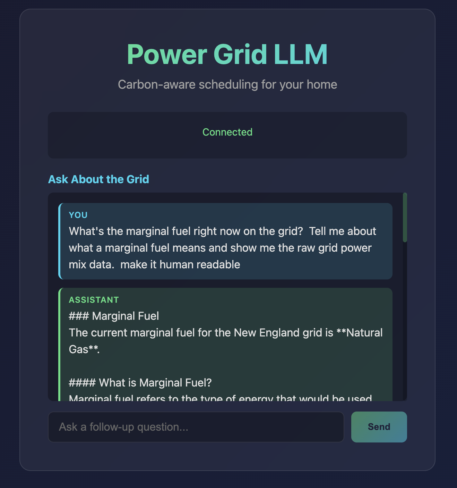
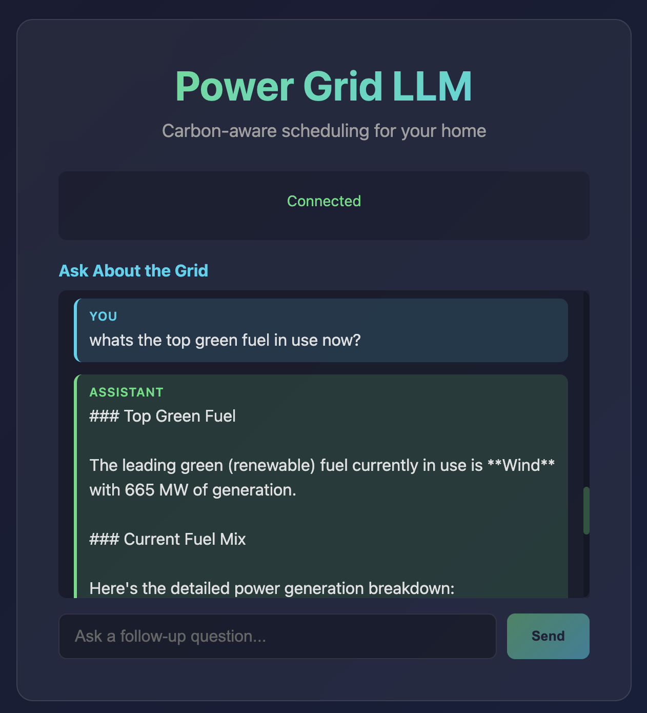

# Power Grid LLM

| v1 - First Light | v2 - MCP Server Integration |
|:---:|:---:|
|  |  |

| v3 - OpenAI Agents SDK | v3 - Follow-up Query |
|:---:|:---:|
|  |  |

A website chatbot to help you decide when to do electricity-intensive tasks to minimize your carbon footprint. The canonical example is doing laundry.

## Goals

- **Educate** about the grid mix (gas/solar/wind) and how it varies by day, time, and season
- **Do good** - if it's a cold/cloudy Friday and tomorrow is sunny Saturday, waiting will likely have a better power mix
- **Build tech** for further iteration in this space

## Quick Start

### Local Development

```bash
# Start the application
docker compose up --build

# Visit:
# - Frontend: http://localhost:3001
# - Backend API: http://localhost:8001/api/health
```

### Production Deployment

See [DEPLOYMENT.md](DEPLOYMENT.md) for full instructions.

```bash
# One-time setup
cd deploy/terraform
terraform init
terraform apply

# Deploy changes
./deploy/build-and-push.sh all
```

## Tech Stack

| Component | Technology |
|-----------|------------|
| Frontend | React |
| Backend | FastAPI |
| Database | SQLite |
| Infrastructure | Terraform + AWS |
| LLM | OpenAI Agents SDK |
| MCP Server | fastmcp |

## Project Structure

```
power_grid_llm/
├── frontend/           # React application
├── backend/            # FastAPI backend
├── deploy/
│   ├── terraform/      # Infrastructure as Code
│   ├── nginx.conf      # Production reverse proxy
│   └── build-and-push.sh
├── docker-compose.yml  # Local development
├── DEPLOYMENT.md       # Full deployment guide
└── developer-quick-reference.md
```

## External Dependencies

- [ne_power_grid_mcp_server](https://github.com/jasonkholden/ne_power_grid_mcp_server) - MCP server for New England Power Grid data

## Documentation

- [DEPLOYMENT.md](DEPLOYMENT.md) - Full deployment and operations guide
- [developer-quick-reference.md](developer-quick-reference.md) - Common commands cheat sheet

---

## Website Features (Planned)

### Front Page
- Pie chart of current power mix
- Line chart of power mix since midnight of previous day
- Line chart of predicted power mix through next day
- Read-only chatbox for laundry timing recommendations
- Button to log "I'm doing laundry now" or plan for later
- Slider on predicted chart showing carbon impact

### Backend
- 5-minute TTL caching on external API requests
- Caching on AI-enabled endpoints to reduce costs

### Out of Scope (for now)
- User login/registration
- Admin role for user approval